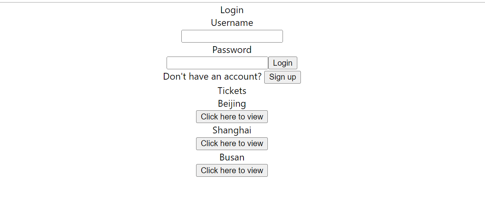
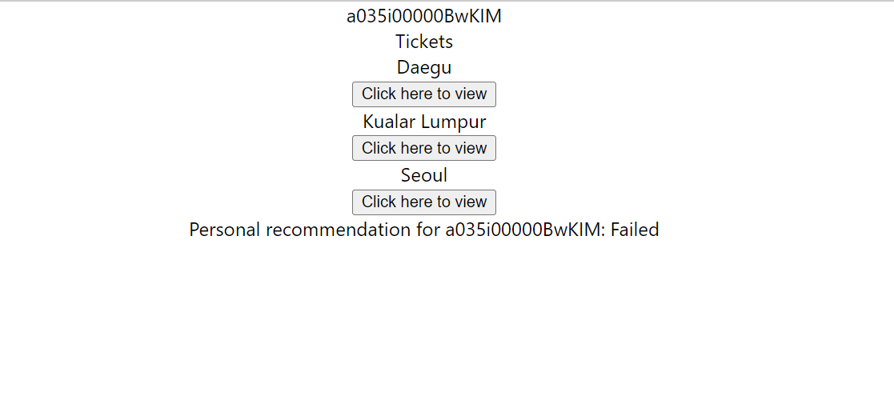
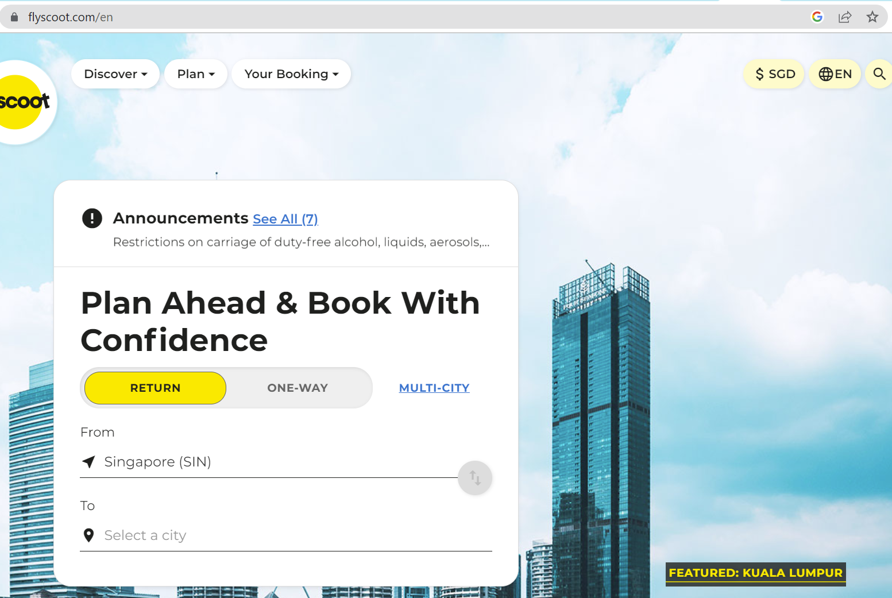
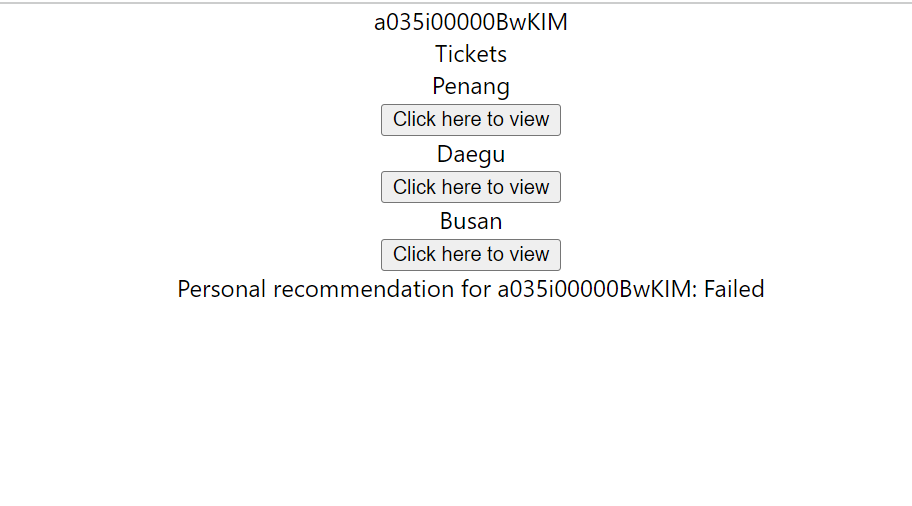

# SIAHackathon
1.1Point - Our submission for SIA AppChallenge 2023 

Our proposed solution uses Salesforce, a cloud-based CRM, to use its functionality to tackle some problems we encounter when navigating the Scoot's website. 
Our solution utilizes Salesforce's Einstein AI to create personalized webpages for users. The idea is that based on what a user follows or likes on their social media accounts, we can estimate which countries they are interested in visting and reccomended flight tickets to those countries for them. Together with Zapier, it allows us to gather insights from users, so even if they do not purchase any tickets, it will help Einstein AI to provide better search results.
We also use Salesforce live chat agent and bots to make it more accessible for users to find help when purchasing their tickets.

However, due to the lack of neccasry licenses to use Einstein AI, we instead provided a react website to showcase a wireframe of our solution to show how we provide a personalized webpage to users. <br/> 

# Setup

Clone this repo into your local device. Since it is a react app, you will need to install react.
```
cd frontend
npm i
cd ..
```

For our backend we use python so you would need to install the following libraries in requirements.txt
```
cd backend
pip install simple_salesforce
pip install openai
pip install flask
pip install flask_cors
pip install python-dotenv
cd ..
```
With this all the dependcies are installed and the react app can be deployed.

# Deployment

## Starting the React app

To start the application, run the following commands and the react website will open.
```
cd frontend
npm start
```

This is how the login page looks like currently. It allows for users to sign up or log in to their personalized accounts and at the bottom, there are 3 tickets that are suggested by default. 



## Creating a user

To begin, you would have to create a user, and you can use any username and password. This would then be recorded into our Salesforce org which saves each user as a record. This would help us to track what you have visited recently.

After that, login using the username and password you used and it will displayed the following page.



## Using the app

Next you can open the Scoot webpage and look through the featured deals. 




By pressing onto one of them like the one below, it will update your user record in our Salesforce org which would then update the reccommended tickets. Now you can see Penang is the top recommendation since the last visited page was a Malaysian state, so trips to Malaysia are highly recommended.




